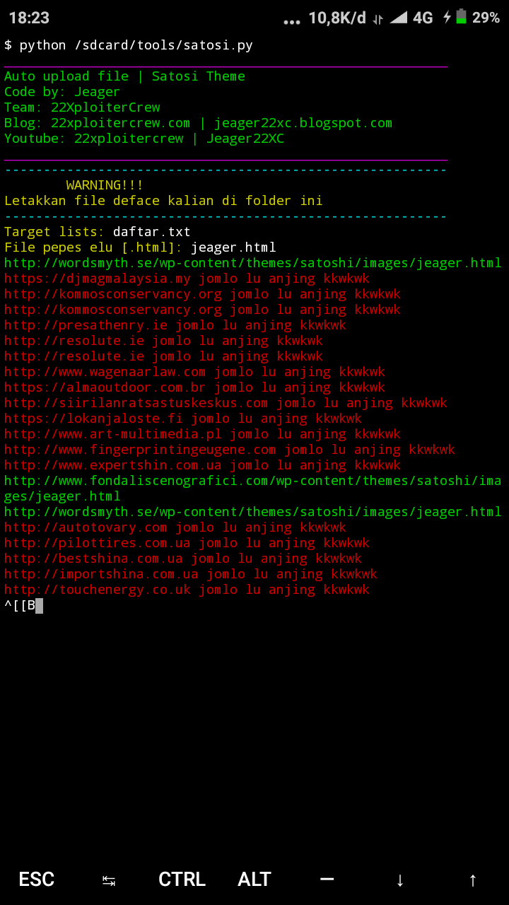
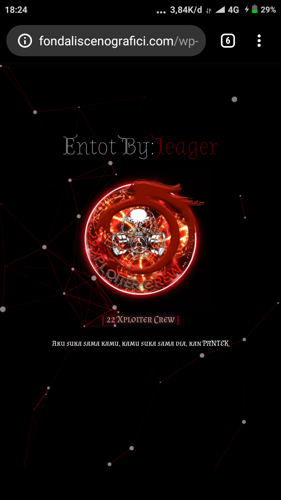

# BotSatosi
<h2>Installasi</h2>

$apt install python -y && apt install git -y

$git clone https://github.com/jeager22xc/BotSatosi && cd BotSatosi && pip install -r requirements.txt

!!! Letakan file deface kalian di folder BotSatosi !!!

<h2>Run:</h2>

python satosi.py

 
 

